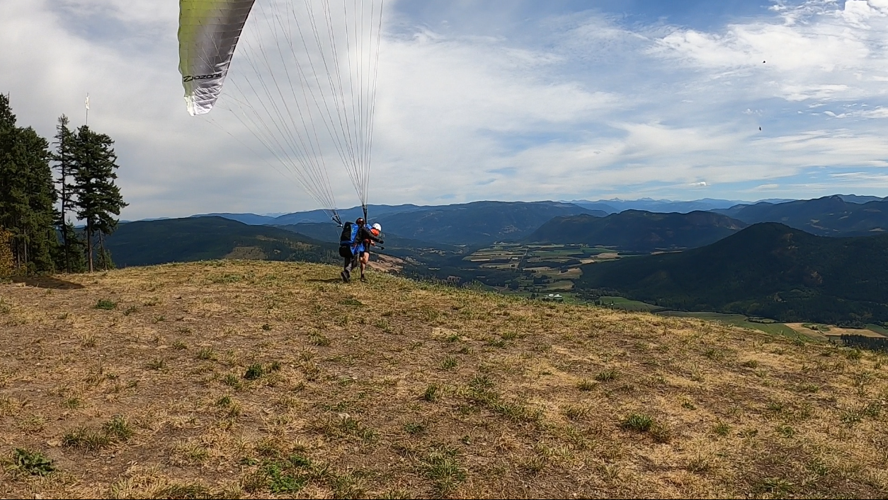

+++
date = "2020-09-09"
title = "September 2020"
+++

# What I'm doing right now

Will be starting Engineering Physics at UBC next week. Trying to climb as much as possible while simultaneously updating my resume. I'm that coordinated.

A few weeks ago I went paragliding with a friend and immediately got hooked:

We're already planning to go back and learn to do it ourselves.

The other day I also reached a huge milestone and sent my first 5.12 on natural protection. For those of you who don't climb, I can unashamedly say that that is hard. I have never been so proud. Unfortunately, my belayer was too busy belaying to get the send pic.

Updated September 9th, 2020 from North Vancouver, British Columbia
