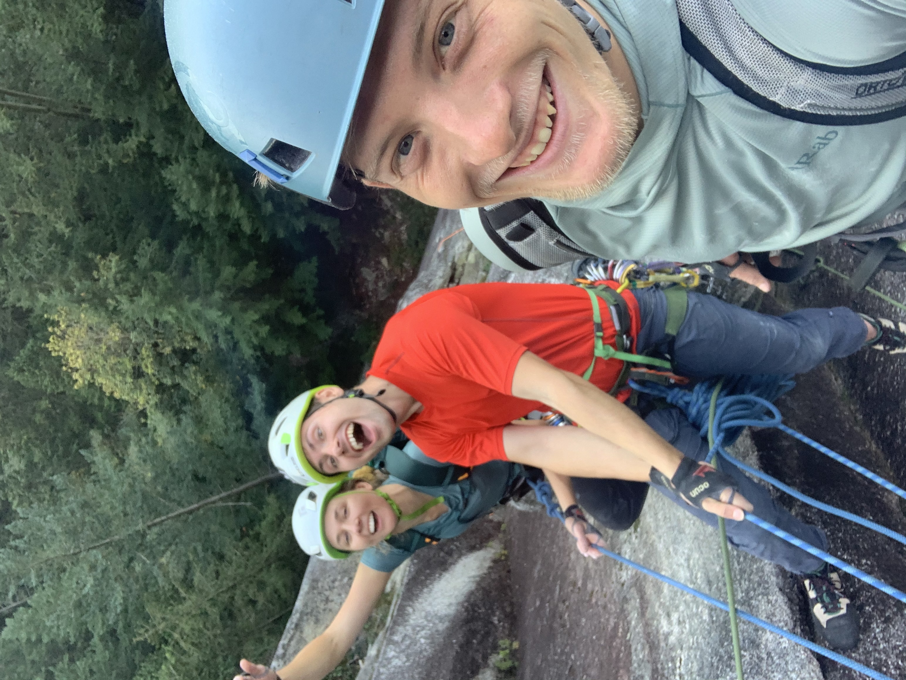

+++
date = "2020-10-04"
title = "October 2020"
+++

# What I'm doing right now

In the swing of things at school. I'm greatly enjoying Engineering Physics---especially meeting all the other incredible people in my program.

This week I started work with UBC Rocket, where I'm helping to write software for three rockets, one of which is going to space (if all goes well).

Lastly, my friends and I tried to climb an amazing route on the Squamish Chief yesterday which quickly turned into a real adventure. After a belay device was dropped midway up we figured it couldn't get worse, until my friend dropped her shoes an hour and a half later.

*Pictured: when we were still having fun :)*

Love you all.

Updated October 4th, 2020 from North Vancouver, British Columbia
